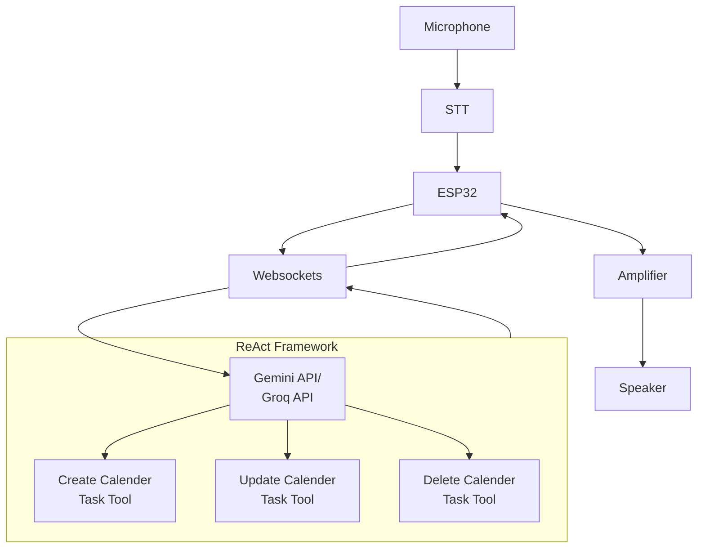
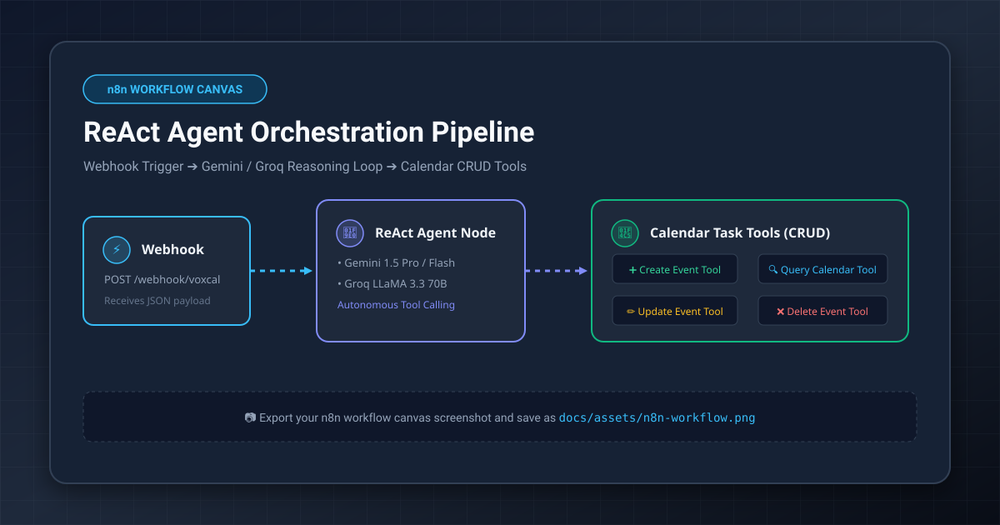

# VoxCal — Voice-Controlled Calendar & Task Assistant

<div align="center">

[](https://www.espressif.com/)
[](https://www.arduino.cc/)
[](https://fastapi.tiangolo.com/)
[](https://n8n.io/)
[](https://ai.google.dev/)
[](https://arxiv.org/abs/2210.03629)
[](https://developer.mozilla.org/en-US/docs/Web/API/WebSockets_API)
[](https://github.com/AnshMNSoni/voxcal)
[](LICENSE)

<p align="center">
  <b>An open-source, edge-to-cloud voice assistant that schedules, manages, and updates your calendar tasks autonomously using ESP32 edge hardware, local FastAPI Gateway, and n8n ReAct AI agents.</b>
</p>

</div>

---

## Table of Contents

- [Overview](#overview)
- [System Architecture](#system-architecture)
- [Sequence Diagram (Create Event Flow)](#sequence-diagram-create-event-flow)
- [Unit Testing & Verification Status](#unit-testing--verification-status)
- [n8n Agentic Workflow Canvas](#n8n-agentic-workflow-canvas)
- [Repository Structure](#repository-structure)
- [Quick Start Guide](#quick-start-guide)
  - [1. Launch n8n Workflow Engine](#1-launch-n8n-workflow-engine)
  - [2. Start Local Python Gateway](#2-start-local-python-gateway)
  - [3. Configure & Flash ESP32 Firmware](#3-configure--flash-esp32-firmware)
- [Configuration & Security](#configuration--security)
- [Serial Monitor & Testing Guide](#serial-monitor--testing-guide)
- [Next Steps & Future Roadmap](#next-steps--future-roadmap)
- [License](#license)

---

## Overview

**VoxCal** transforms how you interact with your calendar and tasks. By combining low-cost, dedicated edge hardware (**ESP32**) with an autonomous reasoning engine (**n8n ReAct Agent** powered by Gemini or Groq LLMs), VoxCal enables natural voice control over your schedule without relying on locked-down proprietary voice assistants.

- **Voice & Hardware Driven**: Edge capture via I2S microphone, audio processing on ESP32, and speech feedback through an amplifier and speaker.
- **Robust WebSocket Pipeline**: Bi-directional, persistent connection between the ESP32 and a local FastAPI Gateway for real-time streaming and fast responses.
- **Autonomous ReAct Agent**: Employs reasoning and acting (Thought ➔ Action ➔ Observation) loops in n8n to parse natural language, resolve relative times ("tomorrow at 3 PM"), and invoke calendar tools dynamically.
- **Complete Calendar CRUD**: Autonomous tools to **Create**, **Read/Query**, **Update**, and **Delete** tasks and calendar events.
- **Privacy & Security First**: Credentials are kept in `.gitignore`'d `secrets.h` and `.env` files, keeping your network credentials safe.

---

## System Architecture

<div align="center">

</div>



---

## Sequence Diagram (Create Event Flow)

Here is the step-by-step sequence of events when a user issues a command such as **"Schedule a team sync tomorrow at 10 AM"**:

```mermaid
sequenceDiagram
    autonumber
    actor User as User (Voice / Serial)
    participant Mic as Microphone & STT
    participant ESP as ESP32 (main.ino)
    participant GW as Gateway (FastAPI)
    participant n8n as n8n ReAct Agent
    participant LLM as Gemini / Groq API
    participant Cal as Google Calendar / CalDAV
    participant Spk as Speaker & Amplifier

    User->>Mic: "Schedule a team sync tomorrow at 10 AM"
    Note over Mic: (Current testing via Serial Monitor input)
    Mic->>ESP: Text message: "Schedule a team sync tomorrow at 10 AM"

    ESP->>GW: WebSocket: {"type": "command", "device_id": "esp32-01", "message": "Schedule a team sync tomorrow at 10 AM"}
    GW->>n8n: HTTP POST /webhook/voxcal/test (JSON Payload)

    rect rgb(24, 30, 42)
        Note over n8n,Cal: ReAct Autonomous Reasoning Loop
        n8n->>LLM: Prompt + Message + Available Tools
        LLM-->>n8n: Thought: User intends to add a new event.<br/>Action: Create Calendar Task Tool {"title": "Team Sync", "start": "2026-09-11T10:00:00"}
        n8n->>Cal: API Call: Create Calendar Event
        Cal-->>n8n: Success: Event ID "ev_4821" created
        n8n->>LLM: Observation: Event successfully scheduled for 10:00 AM
        LLM-->>n8n: Final Answer: "I've scheduled Team Sync for tomorrow at 10:00 AM."
    end

    n8n-->>GW: HTTP 200: {"status": "success", "message": "I've scheduled Team Sync for tomorrow at 10:00 AM."}
    GW-->>ESP: WebSocket Text: {"status": "success", "message": "I've scheduled Team Sync for tomorrow at 10:00 AM."}
    
    ESP->>ESP: Print confirmation to Serial Monitor (Tested & Working)
    
    Note over ESP,Spk: Upcoming Audio Pipeline
    ESP->>Spk: Audio Stream (I2S) / TTS Output
    Spk->>User: 📢 "I've scheduled Team Sync for tomorrow at 10:00 AM."
```



---

## Unit Testing & Verification Status

All modular subsystems have been tested independently and validated through a multi-stage unit testing procedure:

| Subsystem / Module | Scope & Tested Features | Verification Status | Notes |
|:---|:---|:---:|:---|
| **n8n Agentic Module** | • ReAct reasoning loop with Gemini API & Groq API<br>• Calendar **Create** event tool<br>• Calendar **Read / Query** events tool<br>• Calendar **Update** event tool<br>• Calendar **Delete** event tool | ✅ **Tested & Working** | Successfully executes CRUD operations against real calendar APIs with accurate parameter extraction. |
| **ESP32 Hardware Module** | • Wi-Fi connection and automatic reconnect loop<br>• Persistent WebSocket client lifecycle (`WebSocketsClient`)<br>• JSON serialization & deserialization (`ArduinoJson`)<br>• Text payload transmission without audio/speaker | ✅ **Tested & Working** | Validated on physical ESP32 hardware using secure `secrets.h` configuration. |
| **FastAPI Gateway Module** | • Async WebSocket-to-HTTP message forwarder<br>• Client connection tracking & disconnection handling<br>• Resilient 240s HTTP timeout for long-running LLM reasoning<br>• Bi-directional routing from n8n response back to ESP32 | ✅ **Tested & Working** | Validated on `0.0.0.0:8000/ws` via local network and mobile hotspot routing. |
| **Partial End-to-End Pipeline** | • Serial Monitor input on ESP32 ➔ Gateway WebSocket ➔ n8n Webhook ➔ ReAct Agent execution ➔ Gateway ➔ ESP32 ➔ Serial Monitor display | ✅ **Tested & Working** | Verified complete round-trip flow without audio hardware in the loop. |
| **Speaker & Amplifier Module** | • I2S digital-to-analog audio output (MAX98357A)<br>• Text-to-Speech (TTS) audio decoding and playback on ESP32 | ⏳ **Pending / Next Up** | Hardware wiring and I2S DAC integration phase. |
| **Microphone & STT Module** | • I2S microphone (INMP441) audio sampling<br>• Wake-word detection & streaming Speech-to-Text (STT) pipeline | ⏳ **Pending / Next Up** | Hardware wiring and speech recognition phase. |
| **Full Voice End-to-End Flow** | • Spoken Audio ➔ Mic/STT ➔ ESP32 ➔ Gateway ➔ n8n ReAct Agent ➔ Calendar Tool ➔ Gateway ➔ ESP32 ➔ Amplifier/Speaker Audio Output | ⏳ **Pending / Next Up** | Final unified milestone combining all hardware and software modules. |

---

## n8n Agentic Workflow Canvas

Below is the workflow structure orchestrating the incoming Webhook trigger, ReAct Agent node, and Calendar CRUD tool nodes:

<div align="center">



*(Export your n8n workflow canvas screenshot and save it as `docs/assets/n8n-workflow.png` to replace the placeholder above)*

</div>

> [!TIP]
> **Workflow Components in n8n**:
> 1. **Webhook Trigger**: Receives `POST` payloads from the Python Gateway at `/webhook/voxcal/test`.
> 2. **AI Agent (ReAct)**: Configured with Gemini 1.5 Flash/Pro or Groq LLaMA 3.3 70B as the reasoning brain.
> 3. **Calendar Tools**: Custom tool nodes configured for Create Event, Search Events, Update Event, and Delete Event.
> 4. **Respond to Webhook**: Emits formatted JSON containing the response text back to the Gateway.

---

## Repository Structure

```text
voxcal/
├── hardware/
│   └── esp32/
│       ├── main.ino                 # ESP32 Arduino firmware sketch (WebSocket & Serial)
│       ├── secrets.h                # Private Wi-Fi credentials (git-ignored)
│       ├── secrets.h.example        # Credentials template for version control
│       ├── .env                     # Private environment config (git-ignored)
│       ├── .env.example             # Environment template
│       └── README.md                # ESP32 flashing instructions & library setup
├── gateway/
│   ├── server.py                    # FastAPI/Uvicorn WebSocket-to-HTTP Gateway
│   ├── requirements.txt             # Python dependencies (fastapi, uvicorn, httpx, python-dotenv)
│   ├── .env.example                 # Gateway host, port, and n8n webhook URL template
│   └── README.md                    # Gateway setup and testing notes
├── software/
│   ├── docker-compose.yml           # Docker Compose definition for local n8n instance
│   ├── .env.example                 # n8n environment variables
│   └── README.md                    # n8n installation and setup guide
├── docs/
│   └── assets/
│       ├── architecture.svg         # High-resolution vector architecture diagram
│       └── n8n-workflow-placeholder.svg # Visual placeholder for n8n workflow screenshot
├── .gitignore                       # Ignores secrets.h, .env, and build artifacts
├── LICENSE                          # MIT License
└── README.md                        # Project documentation (this file)
```

---

## Quick Start Guide

### 1. Launch n8n Workflow Engine

Start your self-hosted n8n instance using Docker:

```powershell
cd software
docker compose up -d
```

- Open your browser at `http://localhost:5678`.
- Set up your n8n ReAct workflow and ensure your webhook node listens at `/webhook/voxcal/test`.

---

### 2. Start Local Python Gateway

In a separate terminal, install the dependencies and run the Gateway server:

```powershell
cd gateway
pip install -r requirements.txt
python server.py
```

The Gateway server will start listening at `ws://0.0.0.0:8000/ws`.

> [!NOTE]
> Find your computer's local IP address by running `ipconfig` in PowerShell (e.g., `192.168.1.100` or `192.168.137.1` when connected via Mobile Hotspot).

---

### 3. Configure & Flash ESP32 Firmware

1. In `hardware/esp32`, copy the template to create your `secrets.h`:
   ```powershell
   cd hardware/esp32
   Copy-Item secrets.h.example secrets.h
   ```
2. Open `secrets.h` and insert your Wi-Fi credentials:
   ```cpp
   const char* WIFI_SSID     = "YOUR_WIFI_SSID";
   const char* WIFI_PASSWORD = "YOUR_WIFI_PASSWORD";
   ```
3. Open [`hardware/esp32/main.ino`](hardware/esp32/main.ino) in the Arduino IDE.
4. Set `GATEWAY_HOST` to your computer's LAN IP (e.g. `192.168.137.1`).
5. Ensure the required libraries are installed:
   - **WebSockets** by *Markus Sattler*
   - **ArduinoJson** by *Benoit Blanchon* (v6 or v7)
6. Connect your ESP32 via USB, select your board and COM port, and click **Upload** (`Ctrl+U`).
7. Open the **Serial Monitor** at **`115200`** baud rate.

---

## Configuration & Security

To protect your sensitive credentials from accidental commits, VoxCal follows strict security practices:

- **`secrets.h`** & **`.env`**: Ignored in [`.gitignore`](.gitignore) so that private Wi-Fi passwords and API keys are never uploaded to GitHub.
- **Conditional Compilation**: `main.ino` checks `#if __has_include("secrets.h")`, seamlessly loading private credentials locally while providing fallback placeholders for clean compilation on clean checkouts.

---

## Serial Monitor & Testing Guide

Once flashed, test the pipeline directly through the Arduino IDE Serial Monitor:

1. **Verify Connection**:
   ```text
   ==============================
           VoxCal ESP32
   ==============================
   Connecting to Wi-Fi.....
   Wi-Fi connected!
   ESP32 IP: 192.168.137.45

   Connecting to Gateway...
   [WebSocket] Connected to Gateway!
   ```
2. **Issue a Test Command**:
   Type the following into the Serial Monitor input box and hit Enter:
   ```text
   Schedule a project review meeting tomorrow at 4 PM
   ```
3. **Inspect Gateway & Agent Response**:
   The ESP32 wraps the command in JSON, forwards it through the Gateway to n8n, and prints the returned agent message:
   ```text
   [VoxCal] Sending command:
   {"type":"command","device_id":"esp32-01","message":"Schedule a project review meeting tomorrow at 4 PM"}
   [VoxCal] Command sent to Gateway.

   [WebSocket] Gateway Response:
   --------------------------------------
   {
     "status": "success",
     "message": "I've scheduled Project Review Meeting for tomorrow at 4:00 PM."
   }
   --------------------------------------
   ```

---

## Next Steps & Future Roadmap

With the core networking, gateway routing, and agentic CRUD operations verified:

1. **Audio Input**: Wire the INMP441 I2S microphone and integrate wake-word detection or push-to-talk STT streaming.
2. **Audio Output**: Wire the MAX98357A I2S amplifier and speaker to deliver spoken voice confirmations from the agent.
3. **Full Autonomous Voice Loop**: Complete the end-to-end hands-free voice experience from speech input to audio response.

---

## License

This project is licensed under the [MIT License](LICENSE).
