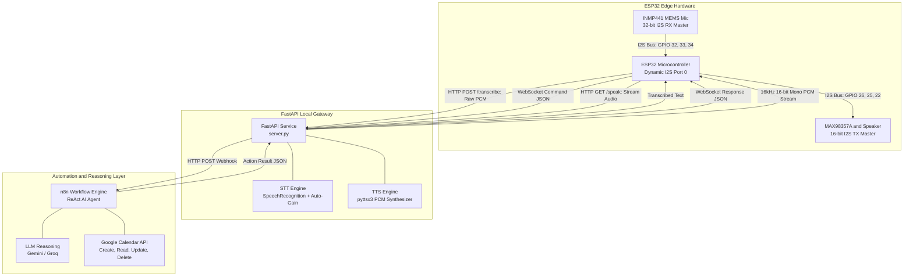
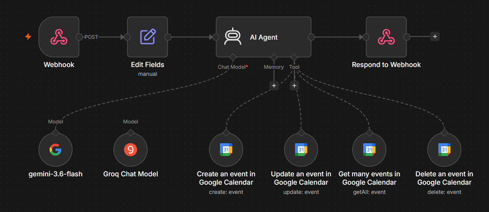

# VoxCal - Voice Controlled Calendar & Task Assistant

<div align="center">

[](https://www.espressif.com/)
[](https://www.arduino.cc/)
[](https://fastapi.tiangolo.com/)
[](https://n8n.io/)
[](https://ai.google.dev/)
[](https://arxiv.org/abs/2210.03629)
[](https://developer.mozilla.org/en-US/docs/Web/API/WebSockets_API)
[](https://github.com/AnshMNSoni/voxcal)
[](LICENSE)

<p align="center">
  <b>An open-source, edge-to-cloud voice assistant that schedules, manages, and updates your calendar tasks autonomously using ESP32 edge hardware, local FastAPI Gateway, and n8n ReAct AI agents.</b>
</p>

</div>

---

## Table of Contents

- [Overview](#overview)
- [System Architecture](#system-architecture)
- [Hardware Wiring & Pinout Diagram](#hardware-wiring--pinout-diagram)
  - [Pin Assignment Table](#pin-assignment-table)
  - [Wiring Schematic](#wiring-schematic)
  - [Dynamic I2S Port Architecture](#dynamic-i2s-port-architecture)
- [How It Works](#how-it-works)
- [Unit Testing Guide](#unit-testing-guide)
  - [Unit Test 1: Offline Speaker Diagnostic](#unit-test-1-offline-speaker-diagnostic)
  - [Unit Test 2: Network Speaker & TTS Streaming](#unit-test-2-network-speaker--tts-streaming)
  - [Unit Test 3: Offline Microphone Waveform Diagnostic](#unit-test-3-offline-microphone-waveform-diagnostic)
  - [Unit Test 4: Full Audio Pipeline Integration](#unit-test-4-full-audio-pipeline-integration)
- [n8n Agentic Workflow Canvas](#n8n-agentic-workflow-canvas)
- [n8n Step-by-Step Configuration](#n8n-step-by-step-configuration)
- [Repository Structure](#repository-structure)
- [Quick Start Guide](#quick-start-guide)
  - [1. Launch n8n Workflow Engine](#1-launch-n8n-workflow-engine)
  - [2. Start Local Python Gateway](#2-start-local-python-gateway)
  - [3. Configure & Flash ESP32 Firmware](#3-configure--flash-esp32-firmware)
- [Configuration & Environment Variables](#configuration--environment-variables)
- [License](#license)

---

## Overview

VoxCal is a dedicated edge-to-cloud voice assistant designed specifically for calendar and task automation. By combining low-cost edge hardware (ESP32, INMP441 MEMS microphone, and MAX98357A I2S amplifier) with an autonomous reasoning engine (n8n ReAct Agent powered by Gemini or Groq LLMs), VoxCal enables hands-free voice control over your schedule without relying on locked-down commercial voice assistants.

Key capabilities:
- Hardware-driven voice input: 24-bit 16kHz I2S digital MEMS microphone sampling.
- Hardware-driven voice feedback: Class D 3W I2S digital-to-analog amplifier and speaker.
- High-efficiency gateway: FastAPI asynchronous bridge providing real-time speech recognition (STT), text-to-speech (TTS), and WebSocket-to-webhook routing.
- Autonomous ReAct Agent: Reasoning and Acting (Thought, Action, Observation) execution in n8n to resolve dates, relative times, and execute calendar CRUD operations.
- Dynamic I2S Architecture: Dynamic hardware peripheral time-sharing on ESP32 to eliminate hardware clock and DMA conflicts.

---

## System Architecture


```mermaid
flowchart TD
    subgraph EdgeHardware["ESP32 Edge Hardware"]
        MIC["INMP441 MEMS Mic<br/>32-bit I2S RX Master"]
        SPK["MAX98357A and Speaker<br/>16-bit I2S TX Master"]
        ESP["ESP32 Microcontroller<br/>Dynamic I2S Port 0"]
        
        MIC -->|"I2S Bus: GPIO 32, 33, 34"| ESP
        ESP -->|"I2S Bus: GPIO 26, 25, 22"| SPK
    end

    subgraph LocalGateway["FastAPI Local Gateway"]
        GW["FastAPI Service<br/>server.py"]
        STT["STT Engine<br/>SpeechRecognition + Auto-Gain"]
        TTS["TTS Engine<br/>pyttsx3 PCM Synthesizer"]
        
        GW --- STT
        GW --- TTS
    end

    subgraph CloudAutomation["Automation and Reasoning Layer"]
        N8N["n8n Workflow Engine<br/>ReAct AI Agent"]
        LLM["LLM Reasoning<br/>Gemini / Groq"]
        CAL["Google Calendar API<br/>Create, Read, Update, Delete"]
        
        N8N --- LLM
        N8N --- CAL
    end

    ESP -->|"HTTP POST /transcribe: Raw PCM"| GW
    GW -->|"Transcribed Text"| ESP
    ESP -->|"WebSocket Command JSON"| GW
    GW -->|"HTTP POST Webhook"| N8N
    N8N -->|"Action Result JSON"| GW
    GW -->|"WebSocket Response JSON"| ESP
    ESP -->|"HTTP GET /speak: Stream Audio"| GW
    GW -->|"16kHz 16-bit Mono PCM Stream"| ESP
```

---

## Hardware Wiring & Pinout Diagram

### Pin Assignment Table

| Peripheral | Module Pin | ESP32 Pin | Function / Description |
|:---|:---|:---|:---|
| **INMP441 Mic** | VDD | 3.3V | Power supply (Do NOT connect to 5V) |
| **INMP441 Mic** | GND | GND | Common Ground |
| **INMP441 Mic** | L/R | GND | Channel Select: GND = Left channel |
| **INMP441 Mic** | SCK | GPIO 32 | Serial Clock (Bit Clock / BCLK) |
| **INMP441 Mic** | WS | GPIO 33 | Word Select (Left-Right Clock / LRC) |
| **INMP441 Mic** | SD | GPIO 34 | Serial Data Out from Microphone |
| **MAX98357A Amp** | VIN | 5V / VBUS | 5V Power for amplifier |
| **MAX98357A Amp** | GND | GND | Common Ground |
| **MAX98357A Amp** | BCLK | GPIO 26 | Bit Clock |
| **MAX98357A Amp** | LRC | GPIO 25 | Word Select (Left-Right Clock) |
| **MAX98357A Amp** | DIN | GPIO 22 | Serial Data In to Amplifier |
| **MAX98357A Amp** | GAIN | Unconnected / GND | Unconnected = 9dB default gain |
| **MAX98357A Amp** | SD_MODE | Unconnected | Default stereo average downmix |

### Wiring Schematic

```text
              +------------------------------------------+
              |               ESP32 DevKit               |
              |                                          |
              |   3.3V  -----------------+               |
              |   GND   ----+            |               |
              |   5V    ---------+       |               |
              |             |    |       |               |
              |   GPIO 32 --+    |       |               |
              |   GPIO 33 --|    |       |               |
              |   GPIO 34 --|    |       |               |
              |   GPIO 26 --|----+-------|--+            |
              |   GPIO 25 --|----+-------|--|--+         |
              |   GPIO 22 --|----+-------|--|--|--+      |
              +-------------|----|-------|--|--|--|------+
                            |    |       |  |  |  |
         +------------------+    |       |  |  |  |
         |                       |       |  |  |  |
+--------v--------+              |       |  |  |  |     +------------------+
|     INMP441     |              |       |  |  |  |     |     MAX98357A    |
|                 |              |       |  |  |  |     |                  |
|  VDD <----------+              |       |  |  |  |     |  VIN <-----------+ (5V)
|  GND <----------+ (GND)        |       |  |  |  +---->|  DIN (GPIO 22)
|  L/R <----------+ (GND)        |       |  |  +------->|  LRC (GPIO 25)
|  SCK <-------------------------+ (32)  |  +---------->|  BCLK (GPIO 26)
|  WS  <-------------------------+ (33)  +------------->|  GND (GND)
|  SD  --------------------------+ (34)                 |  SPK+/- -> Speaker
+-----------------+                                     +------------------+
```

### Dynamic I2S Port Architecture

On the ESP32 silicon:
1. GPIO 25 and GPIO 26 are connected to internal DAC channels routed specifically to `I2S_NUM_0`. Attempting to drive them from `I2S_NUM_1` can prevent proper clock generation.
2. The INMP441 microphone requires 32-bit slot master RX clock synchronization, which operates reliably on `I2S_NUM_0`.
3. Because both modules require `I2S_NUM_0`, the firmware uses **dynamic I2S time-sharing**:
   - During voice recording, `I2S_NUM_0` is initialized in 32-bit RX Master mode on GPIO 32, 33, 34.
   - When recording completes, the driver cleanly switches `I2S_NUM_0` to 16-bit TX Master mode on GPIO 26, 25, 22.
   - Switching takes less than 1 millisecond, preventing hardware conflicts, DMA starvation, and audio distortion.

---

## How It Works

The complete interaction loop follows these stages:

1. **Recording Phase**:
   - The user triggers recording (via Serial Monitor or push-to-talk).
   - ESP32 reads 3 seconds of 24-bit audio from INMP441 on `I2S_NUM_0`.
   - Audio is converted to 16-bit 16000Hz mono PCM in RAM with saturated clamping to prevent digital wrap-around distortion.
2. **Transcription Phase**:
   - The ESP32 sends the raw PCM buffer to the Gateway via `POST /transcribe`.
   - The Gateway applies DC offset removal and automatic gain normalization.
   - SpeechRecognition translates audio into text using Google STT (with multi-language fallback for Indian English, US English, and Hindi).
3. **Agent Reasoning Phase**:
   - The ESP32 forwards the transcribed text as a command payload to the Gateway via WebSocket.
   - The Gateway wraps the command with current timestamp metadata and posts it to n8n at `/webhook/voxcal/test`.
   - The n8n ReAct Agent analyzes the command, selects the appropriate calendar tool (Create, Read, Update, Delete), and executes the operation against Google Calendar.
4. **Speech Output Phase**:
   - n8n returns the agent confirmation message.
   - The Gateway routes the text to `/speak`.
   - The Gateway synthesizes natural speech via `pyttsx3`, normalizes peak amplitude, and streams raw 16kHz PCM bytes back to the ESP32.
   - The ESP32 streams the audio directly into the MAX98357A amplifier via `I2S_NUM_0`, playing the response through the speaker.

---

## Unit Testing Guide

VoxCal provides standalone unit testing sketches in the repository so you can verify each hardware component independently before running the full system.

```text
hardware/esp32/
├── speaker_test/
│   ├── diagnose_speaker.ino   # Unit Test 1: Offline sine tone generator
│   └── speaker_test.ino       # Unit Test 2: Network TTS audio streaming
└── mic_test/
    ├── diagnose_mic.ino       # Unit Test 3: Offline mic waveform plotter
    └── mic_test.ino           # Unit Test 4: Combined mic + STT + speaker test
```

---

### Unit Test 1: Offline Speaker Diagnostic

**File**: [`hardware/esp32/speaker_test/diagnose_speaker.ino`](hardware/esp32/speaker_test/diagnose_speaker.ino)

**Purpose**: Test the MAX98357A amplifier and speaker hardware completely offline (no Wi-Fi, no Gateway server, no Internet required).

**How to Run**:
1. Connect the MAX98357A amplifier pins to the ESP32 (BCLK: 26, LRC: 25, DIN: 22, VIN: 5V, GND: GND).
2. Open `diagnose_speaker.ino` in Arduino IDE.
3. Select your ESP32 board and COM port.
4. Upload the sketch and open Serial Monitor at `115200` baud.
5. **Expected Behavior**:
   - The speaker will play a clear 500 Hz tone for 2 seconds, followed by 2 seconds of silence, cycling continuously.
   - If you hear the tone, your speaker, amplifier, wiring, and power supply are verified.

---

### Unit Test 2: Network Speaker & TTS Streaming

**File**: [`hardware/esp32/speaker_test/speaker_test.ino`](hardware/esp32/speaker_test/speaker_test.ino)

**Purpose**: Test Wi-Fi connectivity, HTTP audio streaming from the FastAPI Gateway, and real-time Text-to-Speech playback.

**How to Run**:
1. Start the Gateway on your computer:
   ```powershell
   cd gateway
   python server.py
   ```
2. Update Wi-Fi credentials in `hardware/esp32/secrets.h` and configure `GATEWAY_HOST` in `speaker_test.ino` with your computer's local IP address.
3. Upload `speaker_test.ino` to the ESP32.
4. Open Serial Monitor at `115200` baud.
5. **Expected Behavior**:
   - The ESP32 connects to Wi-Fi.
   - It sends an HTTP GET request to `http://<GATEWAY_HOST>:8000/speak?text=...`.
   - The Gateway synthesizes speech and streams 16kHz PCM audio over Wi-Fi.
   - The speaker speaks: *"Hello! VoxCal speaker test is working properly."*
   - You can type any text into the Serial Monitor and press Enter to hear it spoken aloud.

---

### Unit Test 3: Offline Microphone Waveform Diagnostic

**File**: [`hardware/esp32/mic_test/diagnose_mic.ino`](hardware/esp32/mic_test/diagnose_mic.ino)

**Purpose**: Test the INMP441 microphone hardware, clock generation, and amplitude levels completely offline.

**How to Run**:
1. Connect the INMP441 pins to the ESP32 (SCK: 32, WS: 33, SD: 34, L/R: GND, VDD: 3.3V, GND: GND).
2. Open `diagnose_mic.ino` in Arduino IDE.
3. Upload the sketch.
4. Open **Tools -> Serial Plotter** in Arduino IDE (or Serial Monitor at `115200` baud).
5. **Expected Behavior**:
   - The Serial Monitor will print real-time peak and raw hex values for both channels:
     ```text
     Left_Peak:0  Right_Peak:4500  (Raw_L:0x00000000 Raw_R:0x0012A400)
     ```
   - Tap the microphone or speak into it: the plotted graph will spike between 2000 and 8000+.
   - **Troubleshooting**: If values stay fixed at `0xFFFFFFFF` (Peak: 1), the data line is floating high. Check that `L/R` is grounded, SCK/WS are not swapped, and pins make firm electrical contact.

---

### Unit Test 4: Full Audio Pipeline Integration

**File**: [`hardware/esp32/mic_test/mic_test.ino`](hardware/esp32/mic_test/mic_test.ino)

**Purpose**: Test the entire unified audio pipeline on a single ESP32 (Mic Recording -> Gateway STT -> Recognized Text -> Speaker TTS).

**How to Run**:
1. Ensure both the INMP441 mic and MAX98357A speaker are connected to their designated pins.
2. Ensure `python server.py` is running in the `gateway` directory.
3. Upload `mic_test.ino` to the ESP32.
4. Open Serial Monitor at `115200` baud.
5. **Expected Behavior**:
   - The ESP32 connects to Wi-Fi.
   - Prompt displays: `>>> RECORDING: Speak now (3 seconds)... <<<`
   - Speak a sentence (e.g. *"What is my schedule today?"*).
   - ESP32 displays:
     ```text
     [Mic Stats] Captured 48000 samples | Left Peak: 0 | Right Peak: 8982 | RMS: 1299
     [Mic Signal OK] Captured audio! (Active Channel: RIGHT)
     [STT] Sending audio to server for transcription...
     
     ==========================================
       You said: "what is my schedule today"
     ==========================================
     
     [Speaker] Playing TTS: "what is my schedule today"
     [Speaker] Done speaking.
     ```
   - The speaker will play back the synthesized confirmation cleanly.
   - Press Enter in the Serial Monitor anytime to test another phrase.

---

## n8n Agentic Workflow Canvas

Below is the workflow structure orchestrating the incoming Webhook trigger, ReAct Agent node, and Calendar CRUD tool nodes:

<div align="center">



</div>

Workflow Components in n8n:
1. **Webhook Trigger**: Receives `POST` payloads from the Python Gateway at `/webhook/voxcal/test`.
2. **AI Agent (ReAct)**: Configured with Gemini 2.5 Flash as the primary reasoning engine, with Groq as fallback.
3. **Calendar Tools**: Custom tool nodes for Create Event, Search Events, Update Event, and Delete Event.
4. **Respond to Webhook**: Returns formatted JSON containing the confirmation text to the Gateway.

---

## n8n Step-by-Step Configuration

To configure the n8n ReAct Agent workflow, the agent requires precise prompt engineering and tool parameter definitions. Dedicated documentation for each component is available in the [`docs/n8n-setup/`](docs/n8n-setup/) directory:

### 1. User Message Template
The User Message Template formats incoming payloads from the ESP32, dynamically injecting the authoritative date, timestamp, and timezone.
- Full Guide: [`docs/n8n-setup/user-prompt.md`](docs/n8n-setup/user-prompt.md)

```text
CURRENT DATE: {{ $json.current_date }}
CURRENT DATE AND TIME: {{ $json.current_datetime }}
TIMEZONE: {{ $json.timezone }}

USER REQUEST:
{{ $json.body.message }}
```

### 2. System Prompt
The System Prompt enforces VoxCal's operational whitelist, relative date arithmetic rules, calendar integrity invariants, and spoken-response constraints.
- Full Guide: [`docs/n8n-setup/system-prompt.md`](docs/n8n-setup/system-prompt.md)

```text
You are VoxCal, a voice-controlled Google Calendar assistant.

You can perform only these operations:
1. Create a calendar event.
2. Update a calendar event.
3. Delete a calendar event.
4. Search calendar events for a particular date.

Use the available Google Calendar tools whenever the user requests a calendar operation.

DATE AND TIME RULES:
- The user request will provide CURRENT DATE, CURRENT DATE AND TIME, and TIMEZONE.
- These values are authoritative.
- Default timezone is Asia/Kolkata.
- Always calculate relative dates from CURRENT DATE.
- Never use dates from previous executions, examples, memory, or training data.
- "today" means CURRENT DATE.
- "tomorrow" means CURRENT DATE + 1 calendar day.
- "yesterday" means CURRENT DATE - 1 calendar day.
- Convert natural-language dates and times into exact calendar date/time values.
- If a start time is provided without an end time or duration, assume 1 hour.
- Do not guess missing dates or times.

CALENDAR RULES:
- Never invent event IDs.
- Never invent calendar data.
- Never create, update, or delete an event without using the appropriate calendar tool.
- Never claim an operation succeeded unless the calendar tool succeeded.
- Ask the user for missing required information.
- Keep responses short and suitable for spoken output.

For relative dates, perform the calculation using the CURRENT DATE supplied in the user message.
```

### 3. Google Calendar Tools Configuration

| Tool | Resource & Operation | Role and Key Configuration | Detailed Reference |
|:---|:---|:---|:---|
| **Create Event** | Event -> Create | Creates a new event in Google Calendar with agent-derived start/end times and title. | [`docs/n8n-setup/create-event-tool.md`](docs/n8n-setup/create-event-tool.md) |
| **Search Events** | Event -> Get Many | Searches events within date ranges. Required to retrieve verified Event IDs before update or delete. | [`docs/n8n-setup/search-events-tool.md`](docs/n8n-setup/search-events-tool.md) |
| **Update Event** | Event -> Update | Modifies existing event fields (start, end, summary) using verified Event IDs. | [`docs/n8n-setup/update-event-tool.md`](docs/n8n-setup/update-event-tool.md) |
| **Delete Event** | Event -> Delete | Permanently removes events. Strictly requires resolving the real Event ID via search prior to deletion. | [`docs/n8n-setup/delete-event-tool.md`](docs/n8n-setup/delete-event-tool.md) |

---

## Repository Structure

```text
voxcal/
├── hardware/
│   └── esp32/
│       ├── main.ino                 # Main ESP32 firmware sketch (WebSocket & Serial)
│       ├── secrets.h                # Private Wi-Fi credentials (git-ignored)
│       ├── secrets.h.example        # Credentials template for version control
│       ├── .env                     # Private environment config (git-ignored)
│       ├── .env.example             # Environment template
│       ├── README.md                # ESP32 hardware setup and flashing guide
│       ├── speaker_test/
│       │   ├── diagnose_speaker.ino # Unit Test 1: Offline sine tone generator
│       │   └── speaker_test.ino     # Unit Test 2: Network TTS audio streaming
│       └── mic_test/
│           ├── diagnose_mic.ino     # Unit Test 3: Offline mic waveform plotter
│           └── mic_test.ino         # Unit Test 4: Combined audio pipeline test
├── gateway/
│   ├── server.py                    # FastAPI Gateway (STT, TTS, WebSocket bridge)
│   ├── requirements.txt             # Python dependencies
│   ├── .env                         # Local gateway environment config (git-ignored)
│   ├── .env.example                 # Gateway environment template
│   └── README.md                    # Gateway setup and API documentation
├── software/
│   ├── docker-compose.yml           # Docker Compose definition for local n8n instance
│   ├── .env.example                 # n8n environment variables template
│   └── README.md                    # n8n installation and setup guide
├── docs/
│   ├── assets/
│   │   ├── architecture.png         # System architecture diagram
│   │   ├── architecture.svg         # High-resolution vector architecture diagram
│   │   └── workflow.png             # n8n workflow canvas screenshot
│   └── n8n-setup/                   # Detailed n8n prompt & tool setup guides
│       ├── README.md                # n8n setup index
│       ├── user-prompt.md           # Dynamic user message template
│       ├── system-prompt.md         # Agent system prompt & rules
│       ├── create-event-tool.md     # Create event tool configuration
│       ├── search-events-tool.md    # Search events tool configuration
│       ├── update-event-tool.md     # Update event tool configuration
│       └── delete-event-tool.md     # Delete event tool configuration
├── .gitignore                       # Ignores secrets.h, .env files, and audio artifacts
├── LICENSE                          # MIT License
└── README.md                        # Project documentation (this file)
```

---

## Quick Start Guide

### 1. Launch n8n Workflow Engine

Start your self-hosted n8n instance using Docker:

```powershell
cd software
docker compose up -d
```

- Open your browser at `http://localhost:5678`.
- Set up your n8n ReAct workflow and ensure your webhook node listens at `/webhook/voxcal/test`.

---

### 2. Start Local Python Gateway

In a separate terminal, install the dependencies and run the Gateway server:

```powershell
cd gateway
pip install -r requirements.txt
python server.py
```

The Gateway server will start listening at `http://0.0.0.0:8000`.

To find your computer's local IP address on Windows:
```powershell
ipconfig
```
Look for `IPv4 Address` under your active Wi-Fi or Ethernet adapter (e.g. `192.168.1.100` or `192.168.137.1`).

---

### 3. Configure & Flash ESP32 Firmware

1. In `hardware/esp32`, copy the template to create your `secrets.h`:
   ```powershell
   cd hardware/esp32
   Copy-Item secrets.h.example secrets.h
   ```
2. Open `secrets.h` and insert your Wi-Fi credentials:
   ```cpp
   const char* WIFI_SSID     = "YOUR_WIFI_SSID";
   const char* WIFI_PASSWORD = "YOUR_WIFI_PASSWORD";
   ```
3. Open [`hardware/esp32/mic_test/mic_test.ino`](hardware/esp32/mic_test/mic_test.ino) in Arduino IDE.
4. Set `GATEWAY_HOST` to your computer's local IP address.
5. Connect your ESP32 via USB, select your board and COM port, and click **Upload**.
6. Open **Serial Monitor** at **`115200`** baud rate.

---

## Configuration & Environment Variables

All sensitive values, credentials, and network endpoints are stored in environment variables and local secret files.

### Gateway Environment (`gateway/.env`)

```env
GATEWAY_HOST=0.0.0.0
GATEWAY_PORT=8000
N8N_WEBHOOK_URL=http://localhost:5678/webhook/voxcal/test
```

### Hardware Environment (`hardware/esp32/.env`)

```env
WIFI_SSID="YOUR_WIFI_SSID"
WIFI_PASSWORD="YOUR_WIFI_PASSWORD"
GATEWAY_HOST="192.168.137.1"
GATEWAY_PORT=8000
GATEWAY_PATH="/ws"
DEVICE_ID="esp32-01"
```

### Security Practice
- All `.env` and `secrets.h` files are excluded from version control via `.gitignore`.
- Example files (`.env.example` and `secrets.h.example`) are provided in each directory as clean templates.

---

## License

This project is licensed under the [MIT License](LICENSE).
