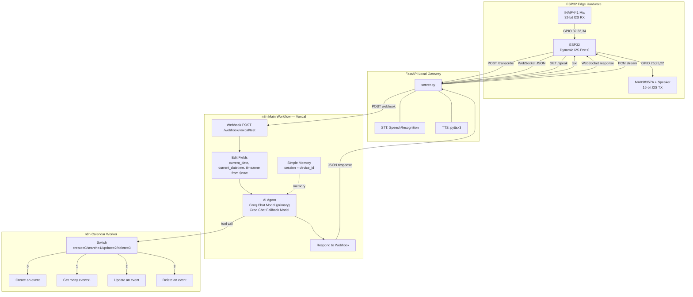
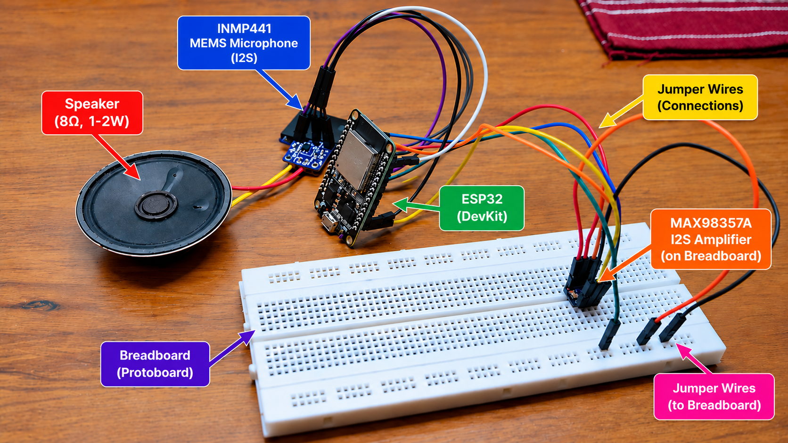
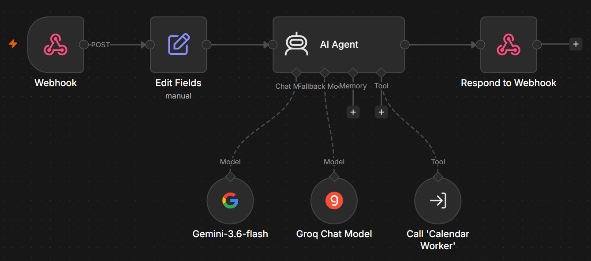
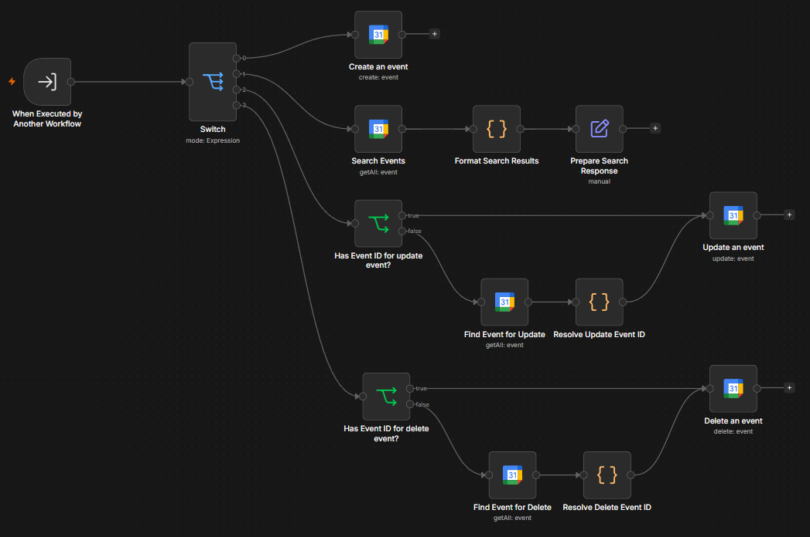

# VoxCal - Voice Controlled Calendar Assistant

<div align="center">
  
</div>

<div align="center">

[](https://www.espressif.com/)
[](https://www.arduino.cc/)
[](https://fastapi.tiangolo.com/)
[](https://n8n.io/)
[-F55036?style=for-the-badge)](https://groq.com/)
[](https://developer.mozilla.org/en-US/docs/Web/API/WebSockets_API)
[](https://github.com/AnshMNSoni/voxcal)
[](LICENSE)

<p align="center">
  <b>An open-source, edge-to-cloud voice assistant that schedules, manages, and updates your calendar
  using ESP32 edge hardware, a local FastAPI Gateway, and a two-layer n8n workflow engine.</b>
</p>

</div>

---

## Table of Contents

- [Overview](#overview)
- [Live Demo](#live-demo)
- [Key Features](#key-features)
- [Current System Architecture](#current-system-architecture)
- [Main n8n Workflow](#main-n8n-workflow)
- [Conversational Memory](#conversational-memory)
- [Calendar Worker Architecture](#calendar-worker-architecture)
- [End-to-End Request Lifecycle](#end-to-end-request-lifecycle)
- [AI Agent System Prompt](#ai-agent-system-prompt)
- [AI Agent User Message Template](#ai-agent-user-message-template)
- [Calendar Worker Tool Contract](#calendar-worker-tool-contract)
- [Date and Time Resolution](#date-and-time-resolution)
- [Event ID Resolution](#event-id-resolution)
- [Error Handling and Safety Invariants](#error-handling-and-safety-invariants)
- [Testing](#testing)
- [Efficiency Analysis](#efficiency-analysis)
- [Old vs. New Architecture](#old-vs-new-architecture)
- [Known Limitations](#known-limitations)
- [Hardware Wiring and Pinout Diagram](#hardware-wiring-and-pinout-diagram)
- [Unit Testing Guide](#unit-testing-guide)
- [FastAPI Gateway](#fastapi-gateway)
- [Repository Structure](#repository-structure)
- [Quick Start Guide](#quick-start-guide)
- [Configuration and Environment Variables](#configuration-and-environment-variables)
- [Hardware Connection](#hardware-connection)
- [n8n Workflow Canvas](#n8n-workflow-canvas)
- [Recent Updates](#recent-updates)
- [License](#license)

---

## Overview

VoxCal is a dedicated edge-to-cloud voice assistant for calendar and task automation. It combines
low-cost edge hardware (ESP32, INMP441 MEMS microphone, MAX98357A I2S amplifier) with an
autonomous reasoning engine built on n8n, powered by Groq LLMs with dual-model failover,
connected to Google Calendar via a two-layer workflow architecture: a conversational Main Agent
(with per-device conversational memory) and a deterministic Calendar Worker subworkflow.

---

## Live Demo

[](https://youtu.be/NLplkhMXXMI)

▶️ **[Watch the full VoxCal demo on YouTube](https://youtu.be/NLplkhMXXMI)**

---

## Key Features

- **Hardware voice input**: 24-bit 16kHz I2S digital MEMS microphone sampling on ESP32.
- **Hardware voice feedback**: Class D 3W I2S digital-to-analog amplifier and speaker.
- **High-efficiency gateway**: FastAPI asynchronous bridge providing STT, TTS, and WebSocket routing.
- **Two-layer n8n architecture**: Main AI Agent interprets natural language; Calendar Worker executes CRUD deterministically.
- **Groq dual-model**: `Groq Chat Model` (primary) with `Groq Chat Fallback Model` for automatic failover.
- **Conversational memory**: n8n Simple Memory with `device_id`-based sessions for multi-turn follow-up handling.
- **Authoritative date/time injection**: n8n Edit Fields computes current date/time from `$now` at execution, preventing model date drift.
- **Event-ID safety**: Never invents event IDs; resolves real IDs before update/delete.
- **Event-move support**: Distinguishes original event location (`originalStartTime`) from new destination (`startTime`).
- **Dynamic I2S time-sharing**: Eliminates hardware clock conflicts on a single I2S peripheral.

---

## Current System Architecture


```mermaid
flowchart TD
    subgraph EdgeHardware["ESP32 Edge Hardware"]
        MIC["INMP441 Mic\n32-bit I2S RX"]
        SPK["MAX98357A + Speaker\n16-bit I2S TX"]
        ESP["ESP32\nDynamic I2S Port 0"]
        MIC -->|"GPIO 32,33,34"| ESP
        ESP -->|"GPIO 26,25,22"| SPK
    end
    subgraph LocalGateway["FastAPI Local Gateway"]
        GW["server.py"]
        STT["STT: SpeechRecognition"]
        TTS["TTS: pyttsx3"]
        GW --- STT
        GW --- TTS
    end
    subgraph MainN8N["n8n Main Workflow — Voxcal"]
        WH["Webhook POST /webhook/voxcal/test"]
        EF["Edit Fields\ncurrent_date, current_datetime, timezone from $now"]
        AG["AI Agent\nGroq Chat Model (primary)\nGroq Chat Fallback Model"]
        MEM["Simple Memory\nsession = device_id"]
        RW["Respond to Webhook"]
        WH --> EF --> AG --> RW
        MEM -.->|"memory"| AG
    end
    subgraph WorkerN8N["n8n Calendar Worker"]
        SW["Switch\ncreate=0/search=1/update=2/delete=3"]
        CE["Create an event"]
        SE["Get many events1"]
        UP["Update an event"]
        DE["Delete an event"]
        SW -->|0| CE
        SW -->|1| SE
        SW -->|2| UP
        SW -->|3| DE
    end
    ESP -->|"POST /transcribe"| GW
    GW -->|"text"| ESP
    ESP -->|"WebSocket JSON"| GW
    GW -->|"POST webhook"| WH
    AG -->|"tool call"| SW
    RW -->|"JSON response"| GW
    GW -->|"WebSocket response"| ESP
    ESP -->|"GET /speak"| GW
    GW -->|"PCM stream"| ESP
```

---

## Main n8n Workflow

**Name:** `Voxcal` | **ID:** `jVxIMtua9iTDiASX`

```
Webhook  →  Edit Fields  →  AI Agent  →  Respond to Webhook
                                │
                    ┌───────────┼───────────┐
                    │           │           │
              Groq Models   Simple     Calendar
             (Primary +    Memory     Worker
              Fallback)   (device_id)  (tool)
```

### Edit Fields Node

Computes authoritative date/time fields from `$now` at webhook receipt:

| Field | n8n Expression | Description |
|:---|:---|:---|
| `current_date` | `{{ $now.setZone('Asia/Kolkata').toFormat('yyyy-MM-dd') }}` | Calendar date |
| `current_datetime` | `{{ $now.setZone('Asia/Kolkata').toFormat('yyyy-MM-dd HH:mm:ss') }}` | Full datetime |
| `timezone` | `Asia/Kolkata` (literal) | Timezone label |
| `body` | `{{ $json.body }}` | Original webhook body passthrough |

### AI Agent Node

- **Primary model**: Groq Chat Model (node: `Groq Chat Model`)
- **Fallback model**: Groq Chat Fallback Model (node: `Groq Chat Fallback Model`)
- **Memory**: Simple Memory (node: `Simple Memory`) — session keyed by `device_id`
- **Tool**: `Call 'Calendar Worker'` — invokes the Calendar Worker subworkflow

The agent resolves natural language to a structured action contract, maintains conversational
context across multi-turn requests via Simple Memory, and calls Calendar Worker.

### Respond to Webhook

Returns:
```json
{ "status": "success", "message": "<agent output>", "source": "n8n" }
```

---

## Conversational Memory

The AI Agent uses **n8n Simple Memory** connected to its Memory input to maintain conversational
context across multi-turn interactions.

### Session Management

- **Session ID expression**: `{{ $json.body.device_id }}`
- Same `device_id` → same conversational context (turns share memory)
- Different `device_id` → isolated conversational context (separate sessions)

This means each ESP32 device maintains its own independent conversation history with the agent.

### Multi-Turn Follow-Up Support

With conversational memory, the agent can handle incomplete follow-up requests by referencing
the previous turn's context:

| Turn | User says | Agent understands |
|:---|:---|:---|
| 1 | "Create a meeting with Ansh tomorrow." | Creates event — but needs a time |
| 2 | "At 6 PM." | Resolves against previous turn → schedules tomorrow at 6 PM |

Other supported follow-up patterns:

- `"at 6 PM"` — sets time for previously mentioned event
- `"tomorrow"` — sets date for previously mentioned event
- `"from 3 to 4"` — sets time range for previously mentioned event
- `"make it 5"` — updates a previously created/discussed event's time
- `"delete it"` — deletes the event from the previous turn
- `"move it to Friday"` — reschedules the previously discussed event

### Memory vs. Calendar Source of Truth

- **Memory** is used only for conversational context (what was discussed in previous turns).
- **Google Calendar** remains the authoritative source of truth for actual event data.
- The agent never relies on memory alone to confirm an event exists — it uses Calendar Worker
  to verify against the real calendar.

### Session Architecture

```text
ESP32
  │
  │ device_id
  ▼
Webhook
  │
  ▼
AI Agent
  │
  ├── Simple Memory
  │      └── Session ID = device_id
  │
  └── Calendar Worker
         ├── Create
         ├── Search
         ├── Update
         └── Delete
```

---

## Calendar Worker Architecture

**Name:** `Calendar Worker` | **ID:** `enfAYZyRbaMrYIol` | **Version:** v0.1.25

The Calendar Worker is a **deterministic execution layer** — it contains no AI model nodes.
All routing is performed by Switch, If, Code, and Google Calendar nodes.

Full documentation: [`docs/n8n-setup/calendar-worker-workflow.md`](docs/n8n-setup/calendar-worker-workflow.md)

### Why a Separate Calendar Worker

The previous architecture exposed four direct calendar tools to the AI Agent. The Calendar Worker:
- Centralises all Google Calendar execution and event-ID resolution.
- Makes CRUD routing deterministic (Switch, not LLM choice).
- Prevents accidental Create pre-search.
- Supports the original/new time distinction for event moves.
- Rejects ambiguous destructive operations with explicit errors.

### Switch Routing

```
{{ { create: 0, search: 1, update: 2, delete: 3 }[$('When Executed by Another Workflow').first().json.action] }}
```

n8n Switch in expression mode requires a numeric index. The action string is mapped via a JS object lookup.

| `action` | Output | Branch |
|:---|:---:|:---|
| `"create"` | `0` | Create an event |
| `"search"` | `1` | Get many events1 |
| `"update"` | `2` | If → Update path |
| `"delete"` | `3` | If1 → Delete path |

### CREATE Branch

`Switch(0)` → **Create an event** (Google Calendar Create). No pre-search.

- Start: `{{ $('When Executed by Another Workflow').first().json.startTime }}`
- End: `{{ $('When Executed by Another Workflow').first().json.endTime }}`
- Summary: `{{ $('When Executed by Another Workflow').first().json.title }}`

Start and End must be explicitly set — omitting them allows Google Calendar to fall back to current time.

Full docs: [`docs/n8n-setup/create-event-tool.md`](docs/n8n-setup/create-event-tool.md)

### SEARCH Branch

`Switch(1)` → **Get many events1** → **Code in JavaScript** → **Edit Fields1** (passthrough)

- `timeMin`: `{{$json.startTime}}` | `timeMax`: `{{$json.endTime}}` | Limit: 10

Full docs: [`docs/n8n-setup/search-events-tool.md`](docs/n8n-setup/search-events-tool.md)

### UPDATE Branch

`Switch(2)` → **If** (eventId not empty?) → two paths:

```
TRUE  → Update an event
FALSE → Get many events (originalStartTime day) → Code in JavaScript1 → Update an event
```

**The central invariant: FIND USING ORIGINAL, UPDATE USING NEW**

| Fields | Purpose |
|:---|:---|
| `originalStartTime`, `originalEndTime` | Find the existing event |
| `startTime`, `endTime` | New time to write to Google Calendar |

Update Get Many searches the `originalStartTime` calendar day:

```
timeMin = DateTime.fromISO(originalStartTime).startOf('day').toFormat("yyyy-MM-dd'T'HH:mm:ss")
timeMax = DateTime.fromISO(originalStartTime).plus({ days: 1 }).startOf('day').toFormat("yyyy-MM-dd'T'HH:mm:ss")
```

The whole day is searched (rather than a narrow window) so the Code node can perform exact
title + parsed-timestamp matching regardless of minor precision differences in stored event times.

Update Code node resolves event ID by matching normalised title and `Date.parse(originalStartTime)`.
Throws on zero or multiple matches.

Update Google Calendar node uses:
- `Event ID` = `{{ $json.eventId }}` (resolved)
- `Start` = `{{ $('When Executed by Another Workflow').first().json.startTime }}` (NEW time from trigger)
- `End` = `{{ $('When Executed by Another Workflow').first().json.endTime }}` (NEW time from trigger)

Full docs: [`docs/n8n-setup/update-event-tool.md`](docs/n8n-setup/update-event-tool.md)

### DELETE Branch

`Switch(3)` → **If1** (eventId not empty?) → two paths:

```
TRUE  → Delete an event
FALSE → Get many events2 (startTime day) → Code in JavaScript2 → Delete an event
```

Delete uses `startTime` (not `originalStartTime`) — deletion has no destination.
Delete Code node matches by normalised title only. Throws on zero or multiple matches.

Full docs: [`docs/n8n-setup/delete-event-tool.md`](docs/n8n-setup/delete-event-tool.md)

---

## End-to-End Request Lifecycle

1. **Recording**: ESP32 captures 3s audio from INMP441 (`I2S_NUM_0` RX mode).
2. **Transcription**: Raw PCM → `POST /transcribe` → Gateway STT → text returned to ESP32.
3. **Command routing**: ESP32 sends WebSocket JSON → Gateway injects metadata → `POST /webhook/voxcal/test`.
4. **n8n processing**:
   - Edit Fields computes `current_date`, `current_datetime`, `timezone` from `$now`.
   - AI Agent resolves dates, calls Calendar Worker with structured action contract.
   - Calendar Worker routes via Switch, executes Google Calendar operation.
   - Respond to Webhook returns `{ status, message, source }`.
5. **Speech output**: Gateway extracts `message` → pyttsx3 TTS → resample to 16kHz PCM → stream to ESP32 → MAX98357A speaker.

---

## AI Agent System Prompt

Full verbatim prompt: [`docs/n8n-setup/system-prompt.md`](docs/n8n-setup/system-prompt.md)

Key rules (summarised):
- Identity: VoxCal, voice calendar assistant.
- Use supplied `current_date`/`current_datetime`/`timezone` as sole source of truth. Never use model's own date.
- All calendar operations go through Calendar Worker only.
- Resolve all relative dates to absolute ISO 8601 before calling Calendar Worker.
- `eventId` must be a real ID or `""`. Never invented.
- Responses: short, natural, voice-friendly. No ISO timestamps, no internal tool names, no filler.

**Example date resolution (if `current_date = 2026-09-29`):**

| User phrase | Resolved value |
|:---|:---|
| `"tomorrow at 10 AM"` | `2026-09-30T10:00:00+05:30` |
| `"day after tomorrow"` | `2026-10-01` |
| `"today"` | `2026-09-29` |

---

## AI Agent User Message Template

Verbatim from AI Agent node `text` field:

```text
CURRENT DATE: {{ $json.current_date }}
CURRENT DATE AND TIME: {{ $json.current_datetime }}
TIMEZONE: {{ $json.timezone }}

USER REQUEST:
{{ $json.body.message }}
```

Full docs: [`docs/n8n-setup/user-prompt.md`](docs/n8n-setup/user-prompt.md)

---

## Calendar Worker Tool Contract

Seven input fields:

| Field | Required | Description |
|:---|:---|:---|
| `action` | ✅ | `create` / `search` / `update` / `delete` |
| `title` | ✅ | Event title |
| `startTime` | ✅ | Absolute ISO 8601 (new time for update; event/search time otherwise) |
| `endTime` | ✅ | Absolute ISO 8601 |
| `eventId` | ✅ | Real Google Calendar event ID or `""` — never invented |
| `originalStartTime` | for update | Existing event start — find the event here |
| `originalEndTime` | for update | Existing event end — find the event here |

Full verbatim tool description: [`docs/n8n-setup/calendar-worker-tool.md`](docs/n8n-setup/calendar-worker-tool.md)

---

## Date and Time Resolution

1. Edit Fields computes `current_date` and `current_datetime` from `$now` (Asia/Kolkata) at webhook receipt.
2. System prompt instructs model to use these as the sole source of truth.
3. All relative dates resolved to absolute ISO 8601 before Calendar Worker call.
4. Calendar Worker receives only absolute timestamps with timezone offsets (e.g. `2026-09-30T10:00:00+05:30`).

---

## Event ID Resolution

| Scenario | Resolution |
|:---|:---|
| `eventId` is known | Passed directly to Worker |
| Update, `eventId = ""` | Worker → Get Many on `originalStartTime` day → Code matches title + `Date.parse(originalStartTime)` |
| Delete, `eventId = ""` | Worker → Get Many on `startTime` day → Code matches title only |

`Date.parse()` normalises timestamps to milliseconds before comparison — more robust than raw ISO string comparison.

---

## Error Handling and Safety Invariants

- **Zero matches**: `Event not found: "<title>" at <time>` — agent reports failure to user.
- **Multiple matches**: Explicit error thrown — agent asks user to disambiguate.
- **Invented event IDs**: Prohibited by system prompt, tool description, and field hints.
- **Missing dates/times**: Agent asks rather than guesses.
- **Success only after operation completes**: Agent emits confirmation only after Worker succeeds.
- **Credentials**: All `.env`, `secrets.h`, OAuth tokens, and API keys are git-ignored.

---

## Testing

### Webhook Endpoint

```
POST http://localhost:5678/webhook/voxcal/test
Content-Type: application/json
```

### Minimal Test Payload

```json
{
  "body": {
    "message": "Schedule a Team meeting tomorrow at 10 AM",
    "device_id": "test",
    "type": "command"
  }
}
```

### PowerShell Examples

**Create:**
```powershell
Invoke-RestMethod -Uri "http://localhost:5678/webhook/voxcal/test" `
  -Method POST -ContentType "application/json" `
  -Body '{"body":{"message":"Schedule a Team meeting tomorrow at 10 AM","device_id":"test","type":"command"}}'
```

**Search:**
```powershell
Invoke-RestMethod -Uri "http://localhost:5678/webhook/voxcal/test" `
  -Method POST -ContentType "application/json" `
  -Body '{"body":{"message":"What do I have tomorrow?","device_id":"test","type":"command"}}'
```

**Update (move event):**
```powershell
Invoke-RestMethod -Uri "http://localhost:5678/webhook/voxcal/test" `
  -Method POST -ContentType "application/json" `
  -Body '{"body":{"message":"Move my Team meeting tomorrow from 10 AM to 11 AM to day after tomorrow at same time","device_id":"test","type":"command"}}'
```

**Delete:**
```powershell
Invoke-RestMethod -Uri "http://localhost:5678/webhook/voxcal/test" `
  -Method POST -ContentType "application/json" `
  -Body '{"body":{"message":"Delete my Team meeting tomorrow","device_id":"test","type":"command"}}'
```

### Verified Test Results

| Operation | Scenario | Result |
|:---|:---|:---|
| Create | "Schedule Team meeting tomorrow at 10 AM" | ✅ Verified |
| Search | "What do I have tomorrow?" | ✅ Verified |
| Update (move) | Team meeting Sept 30 10–11 → Oct 1 10–11 via `originalStartTime` | ✅ Verified |
| Delete | "Delete my Team meeting tomorrow" | ✅ Verified |

---

## Efficiency Analysis

Full analysis: [`docs/n8n-setup/efficiency-analysis.md`](docs/n8n-setup/efficiency-analysis.md)

### Google Calendar API Operations (inside Calendar Worker — not LLM calls)

| Action | API operations |
|:---|:---:|
| Create | 1 |
| Search | 1 |
| Update with known eventId | 1 |
| Update without known eventId | 2 |
| Delete with known eventId | 1 |
| Delete without known eventId | 2 |

### Token Analysis Summary

| Metric | Evidence |
|:---|:---|
| Tool descriptions in agent context: 4 → 1 | Verified from workflow exports |
| Calendar Worker LLM calls: 0 | Verified (Worker has no AI model nodes) |
| Exact token % reduction | Insufficient data — no telemetry available |

---

## Old vs. New Architecture

| Dimension | Old | New |
|:---|:---|:---|
| Calendar tools exposed to AI Agent | 4 (Create, Search, Update, Delete) | 1 (Calendar Worker) |
| Tool routing | LLM selects tool | Deterministic Switch |
| Event-ID resolution | LLM/per-tool | Centralised Worker Code nodes |
| Update time semantics | Single time pair | original (find) + new (write) |
| Unnecessary Create pre-search | Possible | Eliminated by Switch-first design |
| Ambiguous multi-match safety | Not addressed | Explicit error thrown |
| Google Calendar mechanics in prompt | Yes | Isolated in Worker nodes |

---

## Known Limitations

1. **Title-based deletion ambiguity**: Two same-title events on the same day cause an explicit error. User must provide more specificity.
2. **Timed events only**: Update/Delete Code nodes use `event.start.dateTime`. All-day events (using `event.start.date`) are not matched.
3. **Recurring events**: May require additional handling for event series vs. instances.
4. **Fuzzy title matching excluded**: Exact normalised equality prevents wrong-event selection.
5. **Token savings require telemetry**: Efficiency claims are architectural/estimated; runtime measurement requires n8n token logging.
6. **Single calendar per deployment**: Current Worker targets one Google Calendar account.

---

## Hardware Wiring and Pinout Diagram

### Pin Assignment Table

| Peripheral | Module Pin | ESP32 Pin | Function |
|:---|:---|:---|:---|
| **INMP441 Mic** | VDD | 3.3V | Power (NOT 5V) |
| **INMP441 Mic** | GND | GND | Ground |
| **INMP441 Mic** | L/R | GND | Left channel select |
| **INMP441 Mic** | SCK | GPIO 32 | Serial Clock (BCLK) |
| **INMP441 Mic** | WS | GPIO 33 | Word Select (LRC) |
| **INMP441 Mic** | SD | GPIO 34 | Serial Data Out |
| **MAX98357A Amp** | VIN | 5V | Power |
| **MAX98357A Amp** | GND | GND | Ground |
| **MAX98357A Amp** | BCLK | GPIO 26 | Bit Clock |
| **MAX98357A Amp** | LRC | GPIO 25 | Word Select |
| **MAX98357A Amp** | DIN | GPIO 22 | Serial Data In |
| **MAX98357A Amp** | GAIN | Unconnected | 9dB default |
| **MAX98357A Amp** | SD_MODE | Unconnected | Stereo downmix |

### Dynamic I2S Port Architecture

Both INMP441 and MAX98357A require `I2S_NUM_0`. The firmware uses **dynamic I2S time-sharing**:
- Recording: `I2S_NUM_0` in 32-bit RX Master mode (GPIO 32, 33, 34).
- Playback: `I2S_NUM_0` switches to 16-bit TX Master mode (GPIO 26, 25, 22).
- Switch takes < 1 ms, preventing hardware conflicts and audio distortion.

---

## Unit Testing Guide

```text
hardware/esp32/
├── speaker_test/
│   ├── diagnose_speaker.ino   # Test 1: Offline 500Hz sine tone
│   └── speaker_test.ino       # Test 2: Network TTS streaming
└── mic_test/
    ├── diagnose_mic.ino       # Test 3: Offline mic waveform plotter
    └── mic_test.ino           # Test 4: Full mic+STT+speaker pipeline
```

**Test 1 — Offline Speaker**: Upload `diagnose_speaker.ino`. Speaker plays 500Hz tone for 2s, silence 2s, repeating.

**Test 2 — Network TTS**: Start `python server.py` in `gateway/`. Upload `speaker_test.ino`. Speaker says the test phrase. Type in Serial Monitor to speak arbitrary text.

**Test 3 — Offline Mic**: Upload `diagnose_mic.ino`. Open Serial Plotter. Tap mic — values spike 2000–8000+. Fixed `0xFFFFFFFF` means L/R pin is not grounded.

**Test 4 — Full Pipeline**: Start gateway. Upload `mic_test.ino`. Speak into mic — ESP32 transcribes and plays back via speaker.

---

## FastAPI Gateway

**File**: [`gateway/server.py`](gateway/server.py)

### WebSocket `/ws`

Receives command JSON from ESP32, injects metadata, POSTs to n8n, returns agent response over WebSocket.

**Injected metadata:**
```python
n8n_payload = {
    "body": payload,
    "current_date": now.strftime("%Y-%m-%d"),
    "current_datetime": now.strftime("%Y-%m-%d %H:%M:%S"),
    "timezone": os.getenv("TIMEZONE", "Asia/Kolkata"),
    "message": user_command,
    "type": payload.get("type", "command"),
    "device_id": payload.get("device_id", "esp32-01")
}
```

### `POST /transcribe`

Accepts raw PCM, applies DC removal + auto-gain, returns Google STT text.

### `GET /speak`

Accepts `?text=...`, synthesises 16kHz 16-bit mono PCM via pyttsx3, streams to ESP32.

---

## Repository Structure

```text
voxcal/
├── hardware/esp32/
│   ├── main.ino                         # Main ESP32 firmware
│   ├── secrets.h                        # Wi-Fi credentials (git-ignored)
│   ├── secrets.h.example
│   ├── speaker_test/
│   │   ├── diagnose_speaker.ino
│   │   └── speaker_test.ino
│   └── mic_test/
│       ├── diagnose_mic.ino
│       └── mic_test.ino
├── gateway/
│   ├── server.py                        # FastAPI Gateway
│   ├── requirements.txt
│   ├── .env                             # (git-ignored)
│   ├── .env.example
│   └── README.md
├── software/
│   ├── docker-compose.yml               # n8n Docker setup
│   ├── .env                             # (git-ignored)
│   ├── .env.example
│   ├── local_files/                     # Mounted in n8n at /data/shared
│   └── README.md
├── docs/
│   ├── assets/mainagent-workflow.png    # Main VoxCal workflow canvas screenshot
│   ├── assets/subagent-workflow.png     # Calendar Worker subworkflow canvas screenshot
│   └── n8n-setup/
│       ├── README.md                    # Architecture index
│       ├── system-prompt.md             # AI Agent system prompt (verbatim)
│       ├── user-prompt.md               # User message template + Edit Fields
│       ├── calendar-worker-tool.md      # Calendar Worker tool description (verbatim)
│       ├── calendar-worker-workflow.md  # Full Worker node documentation
│       ├── create-event-tool.md
│       ├── search-events-tool.md
│       ├── update-event-tool.md
│       ├── delete-event-tool.md
│       └── efficiency-analysis.md
├── .gitignore
├── LICENSE
└── README.md
```

---

## Quick Start Guide

### 1. Launch n8n

```powershell
cd software
docker compose up -d
```

Open `http://localhost:5678`, create your account, import both workflows, add credentials
(Google Calendar OAuth2, Google Gemini API, Groq API), configure system prompt, and activate.

### 2. Start Gateway

```powershell
cd gateway
pip install -r requirements.txt
python server.py
```

Find your local IP: `ipconfig` (look for IPv4 Address).

### 3. Flash ESP32

```powershell
cd hardware/esp32
Copy-Item secrets.h.example secrets.h
```

Edit `secrets.h` with Wi-Fi credentials. Set `GATEWAY_HOST` to your computer's local IP in `main.ino`.
Upload via Arduino IDE. Open Serial Monitor at `115200` baud.

---

## Configuration and Environment Variables

### `gateway/.env`
```env
GATEWAY_HOST=0.0.0.0
GATEWAY_PORT=8000
N8N_WEBHOOK_URL=http://localhost:5678/webhook/voxcal/test
```

### `software/.env`
```env
N8N_PORT=5678
GENERIC_TIMEZONE=Asia/Kolkata
WEBHOOK_URL=http://localhost:5678/
```

### `hardware/esp32/.env`
```env
WIFI_SSID="YOUR_WIFI_SSID"
WIFI_PASSWORD="YOUR_WIFI_PASSWORD"
GATEWAY_HOST="192.168.137.1"
GATEWAY_PORT=8000
GATEWAY_PATH="/ws"
DEVICE_ID="esp32-01"
```

**Security**: All `.env` and `secrets.h` files are git-ignored. OAuth credentials and API keys
are stored in n8n's encrypted credential store (`voxcal_n8n_data` Docker volume).
The Google Calendar account ID is configured inside n8n Worker nodes and not exposed in this repository.

---

## Hardware Connection



## n8n Workflow Canvas

### Main Workflow (Voxcal)



### Calendar Worker Subworkflow



---

## Recent Updates

### Conversational Memory

- Added **n8n Simple Memory** to the AI Agent.
- Connected Simple Memory to the AI Agent's **Memory** input.
- Session ID is dynamically generated from: `{{ $json.body.device_id }}`
- Same `device_id` → same conversational context.
- Different `device_id` → separate conversational context.
- Enables multi-turn requests such as:
  - "Create a meeting with Ansh tomorrow."
  - "At 6 PM."
- Memory is used only for previously established conversational context.
- Google Calendar remains the source of truth for calendar events.

### AI Agent Improvements

- Added conversational context handling.
- Added follow-up request handling:
  - "at 6 PM"
  - "tomorrow"
  - "from 3 to 4"
  - "make it 5"
  - "delete it"
  - "move it to Friday"
- Added missing date/time validation.
- Prevented the Agent from guessing missing date/time information.
- Added relative date resolution before calling Calendar Worker.
- Relative dates are converted to absolute ISO 8601 timestamps.
- Added event ID validation.
- Prevented fabricated event IDs.
- Added update/delete event resolution through Calendar Worker.

### Calendar Worker Improvements

- Maintained deterministic calendar execution through Calendar Worker.
- AI Agent handles natural-language interpretation.
- Calendar Worker handles actual calendar operations.
- Create, Search, Update, and Delete remain separate Worker branches.
- Added handling for required `endTime` during event creation.
- Prevented empty `endTime` values from being sent to Google Calendar.

### Response Handling

- Added strict final-response rules.
- AI Agent returns only the user-facing response after a successful operation.
- Prevented exposure of:
  - Tool calls
  - Tool arguments
  - JSON
  - Internal reasoning
  - n8n execution details
- Responses are kept short and voice-friendly.

---

## License

This project is licensed under the [MIT License](LICENSE).
