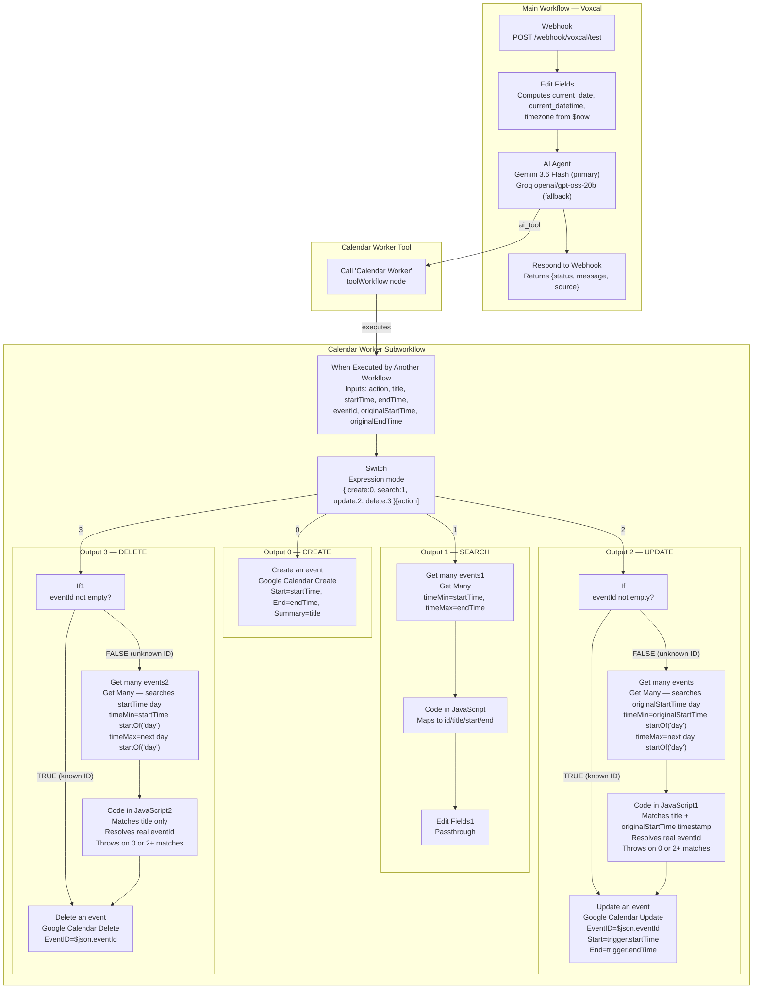

# Calendar Worker — Subworkflow Architecture

## Overview

The **Calendar Worker** is a self-contained n8n subworkflow (`Calendar Worker`,
id: `enfAYZyRbaMrYIol`, version `v0.1.25`) that performs all Google Calendar operations.
It is invoked by the Main VoxCal AI Agent as a tool, receives a structured action contract,
and deterministically routes the request to the correct Google Calendar operation.

The Calendar Worker is an **execution layer**, not a conversational agent. It contains no
AI model nodes. All routing is performed by deterministic n8n nodes (Switch, If, Code, Google Calendar).

---

## Why a Separate Calendar Worker Exists

The previous architecture exposed four Google Calendar tool nodes (Create, Search, Update, Delete)
directly to the AI Agent. This meant:

- The LLM was responsible for selecting the correct calendar tool on every request.
- Event-ID resolution logic was duplicated or depended on the agent's judgment.
- Create could accidentally trigger a prior search (if a Get Many node was placed before the Switch).
- Update using a single time pair could not distinguish "where to find the event" from
  "where to move the event."

The Calendar Worker centralises all Google Calendar execution, event-ID resolution, and CRUD
routing inside one deterministic subworkflow. The Main Agent focuses exclusively on interpreting
natural language and producing a structured action contract. This separation:

- Reduces the LLM's decision surface to intent + parameter extraction.
- Makes CRUD routing deterministic (Switch, not LLM choice).
- Centralises event-ID handling and enforces safety invariants.
- Makes Google Calendar failures debuggable independently of the conversational agent.
- Prevents accidental pre-search on Create.
- Prevents ambiguous destructive operations (multiple-match error).

---

## Full Workflow Canvas (Mermaid)



---

## Switch Routing

**Node name:** `Switch`  
**Type:** `n8n-nodes-base.switch`, version `3.4`  
**Mode:** `expression`

```
{{ { create: 0, search: 1, update: 2, delete: 3 }[$('When Executed by Another Workflow').first().json.action] }}
```

**Why this expression is necessary:**

n8n's Switch node in expression mode requires a **numeric** output index. The Calendar Worker
receives `action` as a string (`"create"`, `"search"`, `"update"`, or `"delete"`). A plain
string cannot be used directly as a Switch output index. The expression maps the string to its
corresponding numeric index using a JavaScript object literal as a lookup table.

| action string | Output index | Branch |
|:---|:---:|:---|
| `"create"` | `0` | Create an event |
| `"search"` | `1` | Get many events1 |
| `"update"` | `2` | If (eventId check) |
| `"delete"` | `3` | If1 (eventId check) |

---

## Node Summary

| Node | Type | Role |
|:---|:---|:---|
| `When Executed by Another Workflow` | executeWorkflowTrigger 1.2 | Entry point; receives 7 input fields |
| `Switch` | switch 3.4 | Routes action string to numeric output index |
| `Create an event` | googleCalendar 1.3 | Creates new Google Calendar event |
| `Get many events1` | googleCalendar 1.3 | Retrieves events for search operation |
| `Code in JavaScript` | code 2 | Maps raw search results to normalised shape |
| `Edit Fields1` | set 3.4 | Passthrough after search Code node |
| `If` | if 2.3 | Update: checks if eventId is known |
| `Get many events` | googleCalendar 1.3 | Update: retrieves events on originalStartTime day |
| `Code in JavaScript1` | code 2 | Update: resolves real eventId by title + timestamp |
| `Update an event` | googleCalendar 1.3 | Updates Google Calendar event |
| `If1` | if 2.3 | Delete: checks if eventId is known |
| `Get many events2` | googleCalendar 1.3 | Delete: retrieves events on startTime day |
| `Code in JavaScript2` | code 2 | Delete: resolves real eventId by title |
| `Delete an event` | googleCalendar 1.3 | Deletes Google Calendar event |

---

## Google Calendar API Operation Counts (per action)

These are Google Calendar API calls inside the Worker — not LLM calls.

| Scenario | Google Calendar API operations |
|:---|:---|
| Create | 1 (Create Event) |
| Search | 1 (Get Many) |
| Update with known eventId | 1 (Update Event) |
| Update without known eventId | 2 (Get Many + Update Event) |
| Delete with known eventId | 1 (Delete Event) |
| Delete without known eventId | 2 (Get Many + Delete Event) |

---

## Architecture Decisions Encoded as Debugging Lessons

The current Calendar Worker architecture encodes the following decisions, each of which
was learned by observing failure modes:

1. **Switch after trigger, not before.** An earlier prototype placed `Get Many` before the Switch.
   This caused Create operations to perform an unnecessary calendar lookup before creating.
   The current architecture places the Switch immediately after the trigger so Create bypasses all lookups.

2. **Numeric Switch output index required.** n8n's Switch in expression mode does not accept a raw
   string action name as an output index. The string-to-number lookup map is required.

3. **Explicit Start/End on Create.** If the Google Calendar Create node's Start and End fields are
   not set to explicit expressions, n8n may fall back to a default (current time), creating the
   event at the wrong time.

4. **originalStartTime/startTime distinction on Update.** Using the new `startTime` to locate an
   event being moved fails because the event does not yet exist at the destination time.

5. **Parsed timestamp comparison vs. raw string comparison.** Comparing ISO 8601 strings as raw
   characters can fail if timezone offset notation differs (e.g. `+05:30` vs. `+0530`).
   Parsing both strings to milliseconds via `Date.parse()` provides normalised comparison.

6. **Multiple-match rejection.** Ambiguous destructive operations (multiple events with same title
   on the same day) are rejected with an explicit error rather than silently choosing one.
